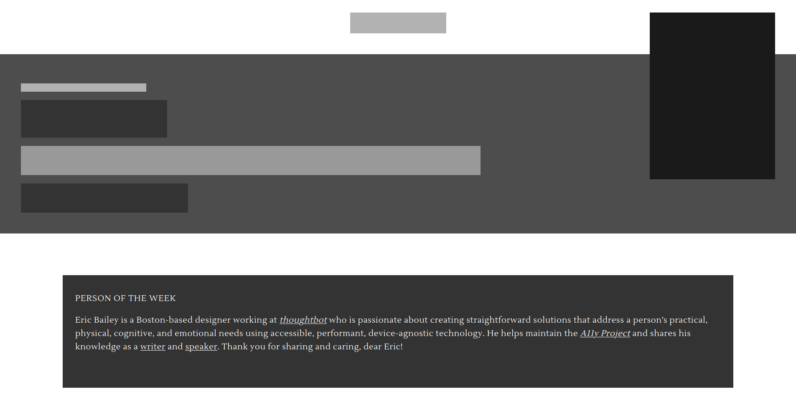

# Design teardown

In this project for [The Odin Project](https://www.theodinproject.com) I created a map of the visual hierarchy of [Smashing Magazine](https://www.smashingmagazine.com/).

## Notes

- The main elements of the page are represented as greyscale `div`'s. The darker, the higher in the visual hierarchy. (This was a good opportunity to use CSS variables).
- In a second step, I added text to the article-elements und tried to roughly recreate the typographic aspect of the site.

## Demo

[View it here](https://reinimax.github.io/design-teardown/)
